**简体中文** | [繁體中文](README_zh-HK.md) | [English](README_en-US.md)

<!-- markdownlint-disable -->

<div align="center">


# OmniMath Pro

一款 **VSCode 风格的沉浸式数学工作台**<br>
基于 Tauri 2 + Next.js 16 + React 19 构建

[Report Issue](https://github.com/humanfirework/OmniMath-Pro/issues) · [Download](https://github.com/humanfirework/OmniMath-Pro/releases)

[](https://github.com/humanfirework/OmniMath-Pro/releases/latest)
[](LICENSE)
[](https://github.com/humanfirework/OmniMath-Pro/actions)
<br>


</div>

<!-- markdownlint-restore -->

---

## 预览

### 工作台主页

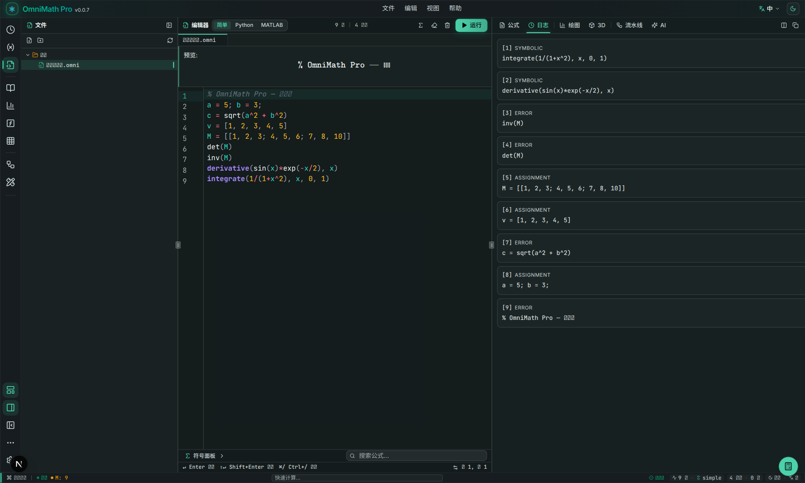

### 浮动计算器（基础模式）

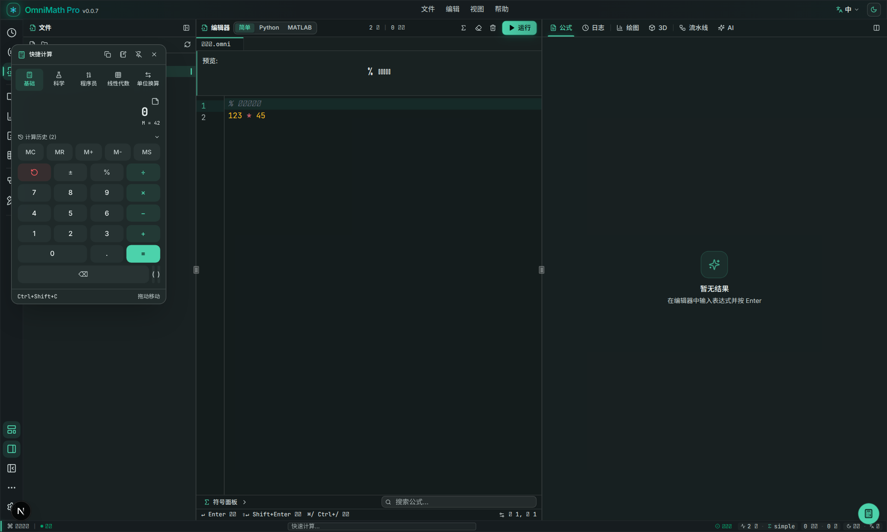

### 浮动计算器（便签面板）


### 浮动计算器（科学模式）

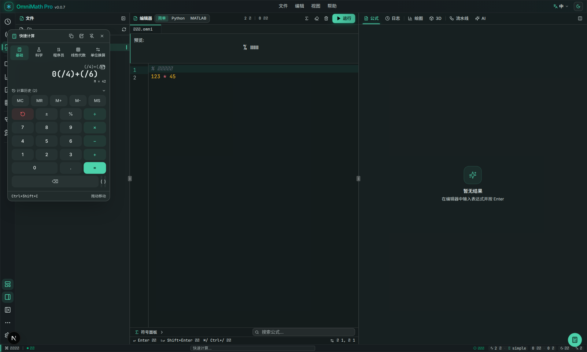

### 浮动计算器（单位换算）

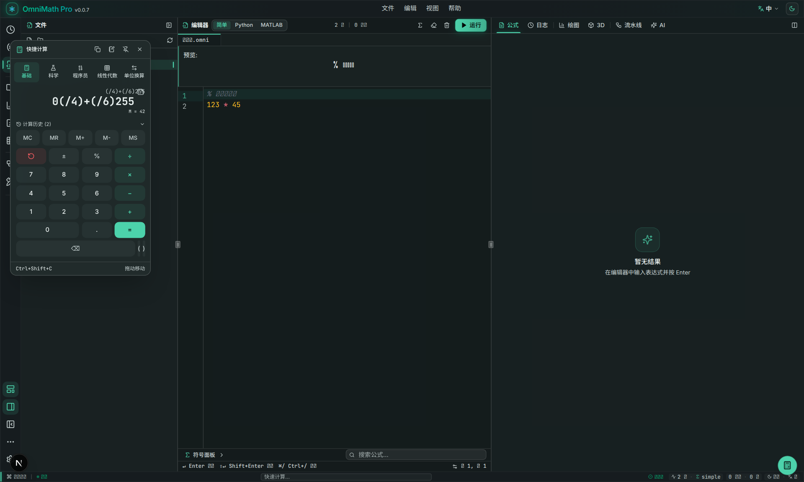

### 2D 函数绘图

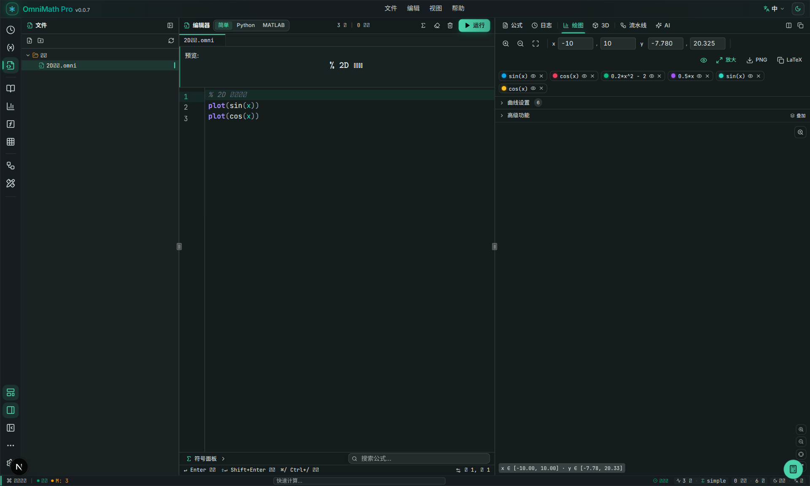

### 3D 曲面绘图

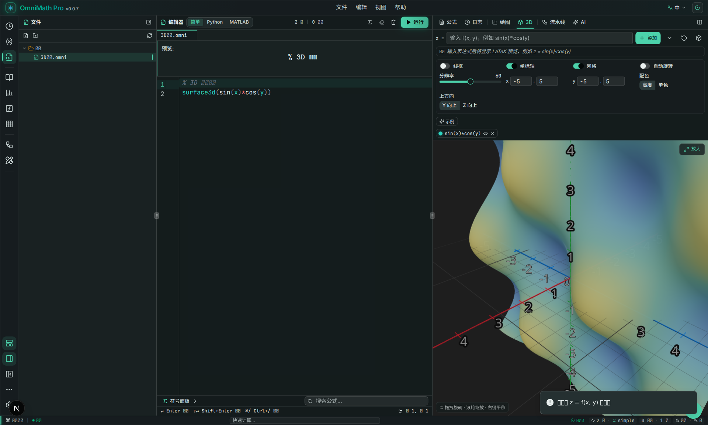

### 线性代数求解

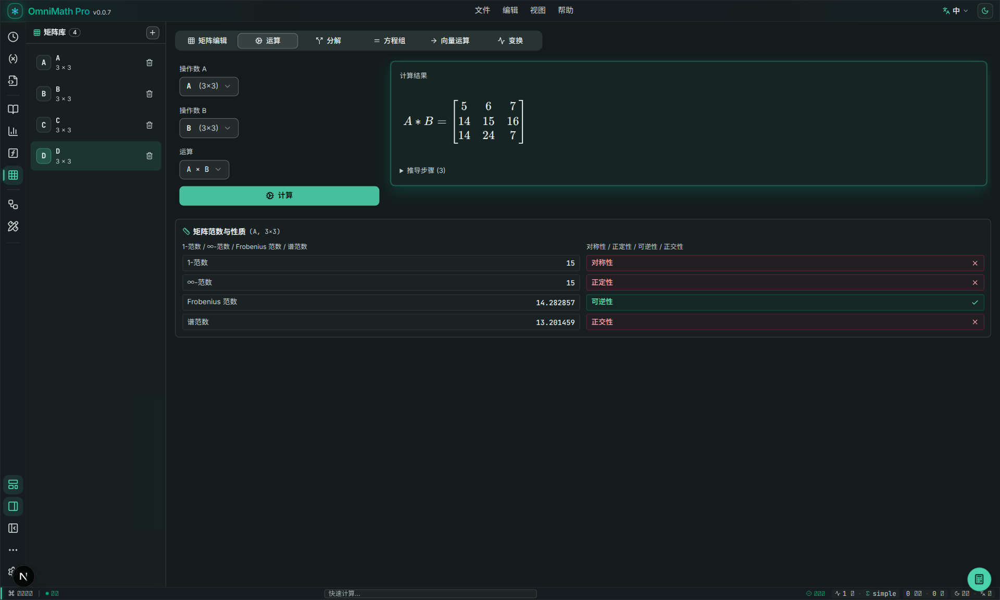

### Pipeline 节点工作流

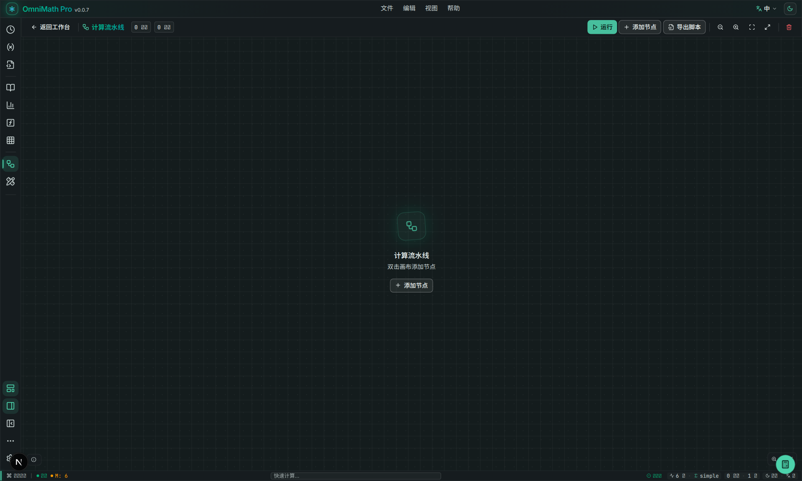

### 求解器工作台

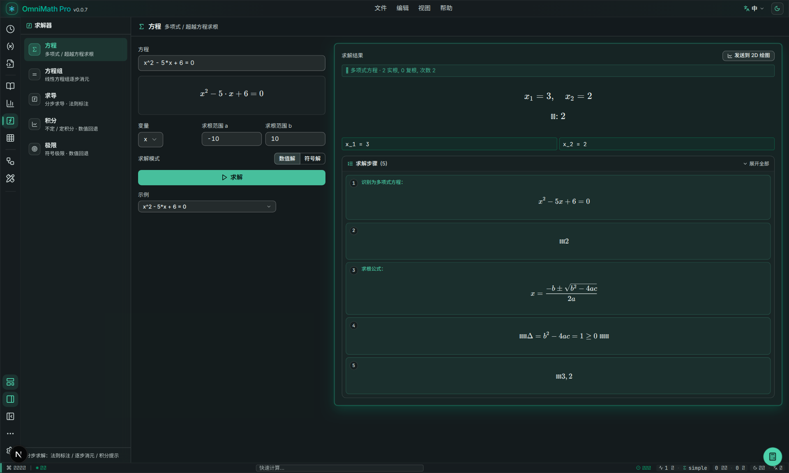

### 设置面板

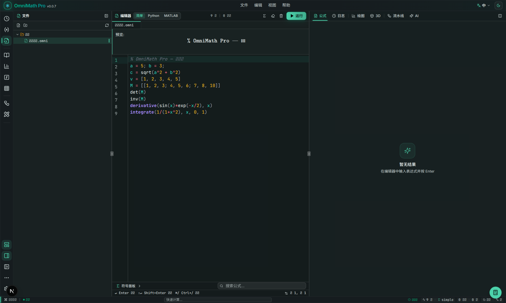

### 浅色模式

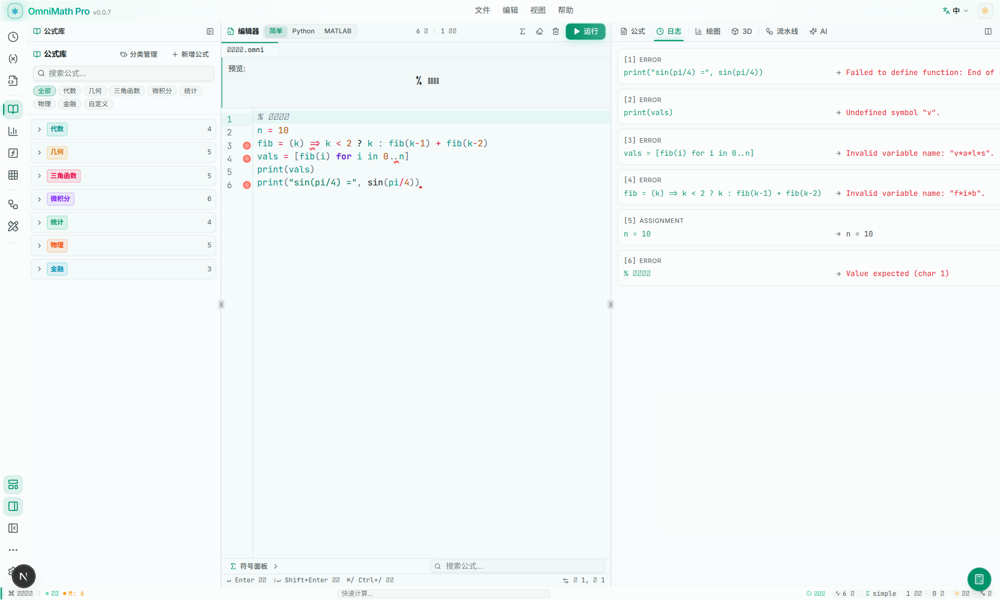

---

## 为什么是 OmniMath Pro？

普通计算器功能有限，专业数学软件又过于笨重。OmniMath Pro 取其中间态：

- **启动快、离线用** — 基于 Tauri 的本地桌面应用，无需网络
- **编辑器式交互** — 三栏布局、命令面板、快捷键，像 VSCode 一样顺手
- **输入即所得** — 支持类自然语言、Python/MATLAB 风格语法，实时渲染 LaTeX
- **可视化工作流** — 节点式 Pipeline，拖拽连接即可构建复杂计算图
- **深度可定制** — 任务栏位置、面板显隐、主题模式、自动隐藏均可记忆

---

## 核心功能

### 计算与符号运算

- 基于 **mathjs** 的高性能计算引擎
- 支持变量、函数、矩阵、复数、微积分、方程求解
- 多种输入风格：简洁模式 / Python 风格 / MATLAB 风格
- 变量面板实时查看与管理计算状态

### 2D / 3D 绘图

- 直角坐标、极坐标与参数方程 2D 绘图
- 多曲线默认同一坐标系叠加（overlay），分面（facet）保留为切换项
- 自动标注重值点与零点
- 鼠标滚轮缩放、拖拽平移、悬停读数
- 极端范围与异常表达式防御，避免崩溃
- 数学软件风格配色（参考 JSXGraph / GeoGebra）
- 深色/浅色模式独立配色方案
- **参数滑块系统**：自动扫描表达式中的自由参数（排除自变量与已定义符号），为每个参数生成 Desmos 风格滑块，支持数值输入与范围/步长编辑，拖动实时重绘，配置跨刷新持久化
- **自动交点**：一键计算所有可见曲线两两交点，图上标注坐标并在面板列出所属曲线对，滑块拖动时实时联动更新
- 4 层 Canvas 架构，流畅 60fps 渲染；滑块拖动期间自动降采样保帧率，松手后恢复高精度重采样

### 公式渲染

- 使用 **KaTeX** 即时渲染 LaTeX
- 长公式支持水平滚动、缩放（0.6x–2.0x）与折叠/展开
- 一键复制 LaTeX 源码

### 线性代数

- 矩阵输入、编辑与粘贴解析（支持 MATLAB / CSV / TSV 格式）
- 高斯消元、LU / QR 分解、特征值计算
- 线性方程组求解，自动判断唯一解 / 无解 / 无穷解

### 求解器工作台

- 独立全屏工作台（与线性代数工作台布局一致），入口位于 ActivityBar 数学工具组
- 左侧求解类型导航：方程 / 方程组 / 求导 / 积分 / 极限
- 右侧输入区 + KaTeX 结果区 + 分步展示区，主工作区不再受侧边栏宽度限制
- **分步求解增强**：求导步骤标注所用法则（幂法则 / 乘积 / 商 / 链式等），线性方程组逐步消元与回代，积分输出中间变换步骤，每步以 KaTeX 渲染并附规则说明
- 结果可一键发送到 2D 绘图继续可视化

### 浮动计算器

- `Ctrl/Cmd + Shift + C` 快速调出便携式计算器
- **五种模式**：基础计算、科学计算、程序员模式（HEX/DEC/OCT/BIN）、线性代数（矩阵行列式/逆/转置/特征值）、单位换算
- 支持长度、重量、温度、面积、体积、时间单位转换
- **便签面板**：点击侧边便签图标展开草稿区，可随时记录数据与中间结果，内容持久化保存，刷新后不丢失
- **历史回填**：点击历史记录中的任意条目，自动回填到计算输入区继续计算
- 可拖拽、可固定、可复制结果

### 节点式工作流（Pipeline）

- ComfyUI / Blueprint 风格的数学节点图
- 拖拽节点、连接端口、实时传播计算结果
- 独立 mathjs 作用域，不污染主工作台变量

### 界面与体验

- **VSCode 风格布局**：ActivityBar / SidePanel / Editor / Preview / StatusBar
- **窗口控制按钮**：自定义标题栏右侧提供最小化、最大化/还原、关闭三按钮（仅 Tauri 桌面壳内显示），关闭按钮 hover 红色高亮
- **精简顶部栏**：视图切换入口统一收敛至 ActivityBar，标题栏不再出现重复按钮，减少视觉噪音
- **任务栏**：支持左右切换、锁定/解锁、自动隐藏、手动隐藏
- **面板显隐**：编辑器、预览区、侧边栏、任务栏均可独立显示/隐藏，状态自动记忆
- **深色 / 浅色主题**：高对比度配色，符合 WCAG 可读性标准，深色主题采用分层表面设计（background / card / popover 三级递进）
- **中英文 i18n**：界面一键切换中/英文，编辑器预览栏、视图模式等全部国际化
- **命令面板**：`Ctrl/Cmd + Shift + P` 快速执行命令
- **设置面板**：7 大分类（外观/编辑器/布局/导出/语言/快捷键/关于），自动检查更新，托盘最小化
- **结构化高级设置**：高级区由 JSON 文本编辑改为表单控件（数字输入 / 开关 / 下拉），修改即时生效与持久化，非法输入就地提示且不写入
- **自托管字体**：Inter、Noto Sans SC、STIX Two Math 字体随应用本地分发（woff2），不依赖系统预装字体，无 CJK 字体的环境也能正常显示中英文，完全离线可用
- **统一过渡动画**：视图与面板切换使用轻量 transform/opacity 过渡（150–250ms），优先 CSS 过渡，不引入重型动画依赖
- **无障碍**：支持 `prefers-reduced-motion` 系统偏好
- **状态栏分组**：右侧信息按逻辑分组（编辑器信息 / 数据信息 / 偏好设置），药丸式圆角分组替代密集竖线分隔
- **面板图标**：侧边栏每个面板标题均带语义图标，与 ActivityBar 图标保持一致
- **空状态统一**：历史、变量、预览等面板空状态均使用统一的图标 + 动画容器

---

## 截图展示

### 主工作台

| 深色主题 | 浅色主题 |
| :---: | :---: |
|  |  |

便签与笔记工作流：


### 功能面板

| 模块 | 截图 |
| :--- | :---: |
| 浮动计算器（深色） |  |
| 浮动计算器（浅色） |  |
| 方程求解器 |  |
| 线性代数（矩阵编辑器） |  |
| AI 助手 |  |

### 可视化绘图

| 2D 绘图（自定义颜色/线宽） | 3D 曲面绘图 |
| :---: | :---: |
|  |  |

---

## 下载安装

前往 [Releases](https://github.com/humanfirework/OmniMath-Pro/releases) 页面，选择对应平台安装包：

| 平台 | 推荐安装包 |
|---|---|
| Windows | `OmniMath-Pro_xxx_x64-setup.exe` / `.msi` |
| macOS (Apple Silicon / M 系列) | `OmniMath-Pro_xxx_aarch64.dmg` |
| macOS (Intel) | `OmniMath-Pro_xxx_x64.dmg` |
| Linux | `OmniMath-Pro_xxx_amd64.deb` / `.AppImage` |

> 文件名中的 `xxx` 为版本号，请下载与你的系统架构匹配的版本。

---

## 技术栈

| 层级 | 技术 |
|---|---|
| 前端框架 | Next.js 16、React 19、TypeScript 5 |
| 样式与组件 | Tailwind CSS v4、shadcn/ui、Framer Motion |
| 状态管理 | Zustand |
| 计算引擎 | mathjs |
| 公式渲染 | KaTeX |
| 3D 渲染 | Three.js、react-three-fiber |
| 节点图 | 自研 Canvas + SVG 节点引擎 |
| 桌面壳 | Tauri 2（Rust + wry/WebKit） |
| 打包 | Tauri bundler（.msi / .exe / .dmg / .deb / .AppImage） |

---

## 项目结构

```
omnimath-pro/
├── src/
│   ├── app/                    # Next.js App Router（layout / page / globals.css）
│   ├── components/
│   │   ├── workbench/          # 主工作台（布局、面板、绘图、节点）
│   │   │   ├── layout/         # ActivityBar、EditorPanel、PreviewPanel、SidePanel、StatusBar
│   │   │   ├── panels/         # History、Variables、FormulaLibrary、LinearAlgebra、Solver、CommandPalette
│   │   │   ├── plots/          # Plot2DCanvas 等绘图组件
│   │   │   └── nodes/          # 节点式 Pipeline 引擎与 UI
│   │   └── ui/                 # shadcn/ui 组件库
│   ├── lib/
│   │   ├── engine/             # 数学计算引擎与求值器
│   │   ├── plots/              # 2D/3D 绘图采样与辅助函数
│   │   ├── store/              # Zustand 状态管理（含持久化）
│   │   └── i18n/               # 中英文翻译字典
│   └── hooks/                  # 自定义 React Hooks
├── src-tauri/                  # Tauri 桌面壳（Rust）
│   ├── src/                    # main.rs / lib.rs
│   ├── icons/                  # 全平台应用图标
│   ├── capabilities/           # Tauri 权限配置
│   └── tauri.conf.json         # 构建/窗口/打包配置
├── prisma/                     # Prisma schema（保留未来扩展）
├── public/                     # 静态资源（logo、截图、自托管字体等）
│   ├── fonts/                  # 自托管 woff2 字体（Inter / Noto Sans SC / STIX Two Math）
│   └── screenshots/            # README 截图
└── .github/workflows/          # 多平台自动发布工作流
```

---

## 开发环境

### 前置依赖

- [Node.js](https://nodejs.org/) 或 [bun](https://bun.sh/)（推荐 bun）
- [Rust](https://rustup.rs/) stable

#### Linux 额外依赖

```bash
sudo apt-get update
sudo apt-get install -y libwebkit2gtk-4.1-dev build-essential curl wget file \
  libxdo-dev libssl-dev libayatana-appindicator3-dev librsvg2-dev libgtk-3-dev
```

#### Windows

- [Microsoft Visual C++ Build Tools](https://visualstudio.microsoft.com/visual-cpp-build-tools/)
- [WebView2](https://developer.microsoft.com/microsoft-edge/webview2/)（Win11 已自带）

#### macOS

- Xcode Command Line Tools：`xcode-select --install`

### 本地开发

```bash
# 安装依赖
bun install

# 方式一：纯 Web 开发（浏览器访问 http://localhost:3000）
bun run dev

# 方式二：Tauri 桌面开发模式（自动打开桌面窗口）
bun run tauri:dev
```

### 构建 Web 产物

```bash
bun run build       # 静态导出到 ./out/
bun run preview     # 本地预览 ./out/
```

### 构建桌面安装包（当前平台）

```bash
bun run tauri:build
```

产物位于 `src-tauri/target/release/bundle/`。

---

## 自动发布

推送 `v*` 标签即可触发 GitHub Actions，自动在 Windows、macOS（Intel + Apple Silicon）、Linux 上构建并发布到 Release：

```bash
git tag v0.1.3
git push origin v0.1.3
```

详见 [`.github/workflows/release.yml`](.github/workflows/release.yml)。

---

## 常用命令

| 命令 | 作用 |
|---|---|
| `bun run dev` | 启动 Next.js 开发服务器 |
| `bun run build` | 静态导出到 `out/` |
| `bun run lint` | 运行 ESLint 代码检查 |
| `bun run tauri:dev` | Tauri 桌面开发模式 |
| `bun run tauri:build` | 构建当前平台桌面安装包 |
| `bun run db:push` | Prisma schema 同步（可选） |

---

## 许可证

[MIT](LICENSE)
