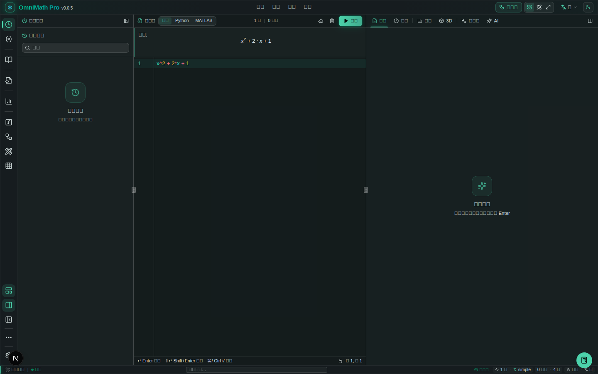
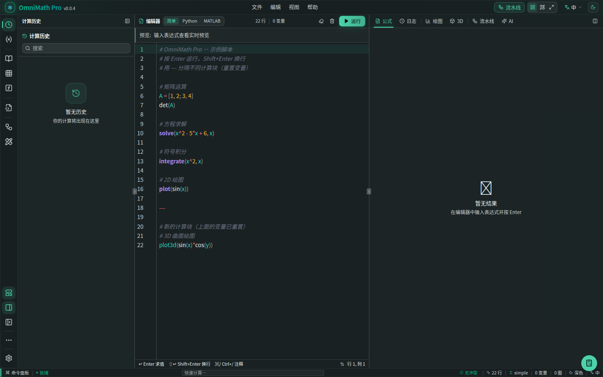
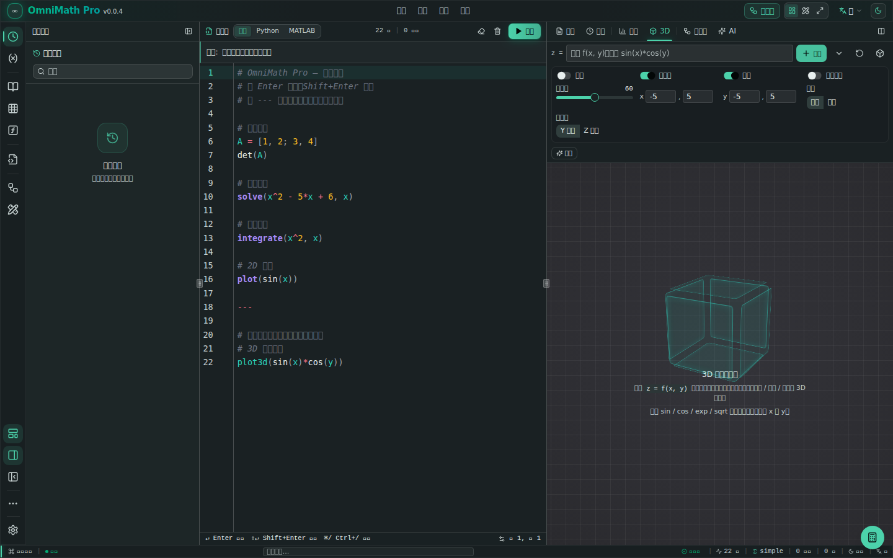
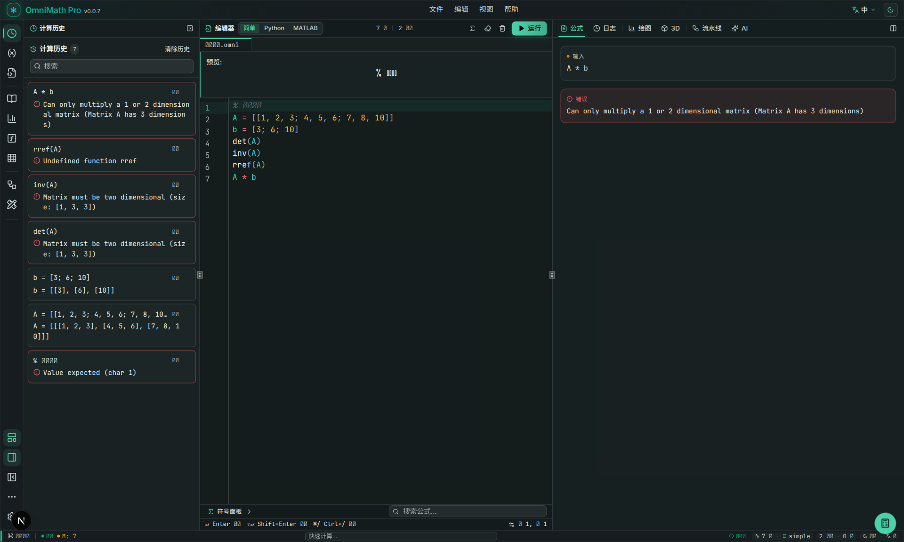
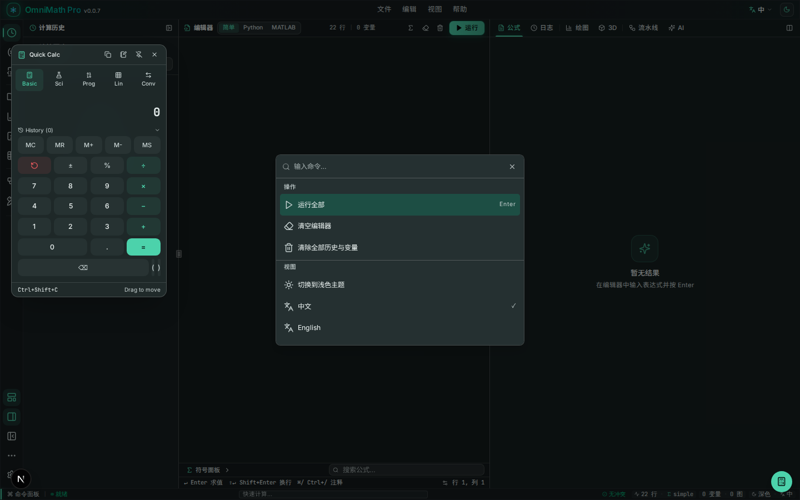
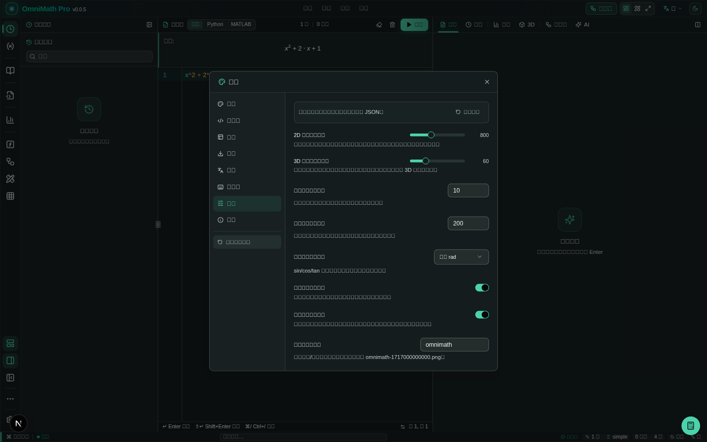
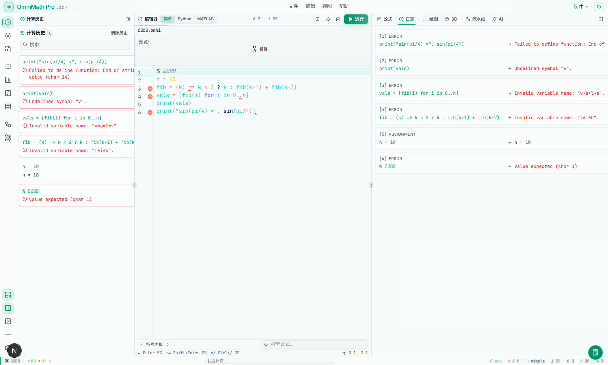

> [简体中文](README.md) | [繁體中文](README_zh-HK.md) | **English**

<!-- markdownlint-disable -->

<div align="center">


# OmniMath Pro

A **VSCode-style immersive math workbench**<br>
Built with Tauri 2 + Next.js 16 + React 19

[Report Issue](https://github.com/humanfirework/OmniMath-Pro/issues) · [Download](https://github.com/humanfirework/OmniMath-Pro/releases)

[](https://github.com/humanfirework/OmniMath-Pro/releases/latest)
[](LICENSE)
[](https://github.com/humanfirework/OmniMath-Pro/actions)
[](https://github.com/humanfirework/OmniMath-Pro)
<br>


</div>

<!-- markdownlint-restore -->

---

## Preview

### Workbench



### 2D Plotting



### 3D Surface Plotting



### Linear Algebra



### Floating Calculator



### Settings Panel



### Light Mode



---

## Why OmniMath Pro?

Regular calculators are too simple, and professional math software is often too heavy. OmniMath Pro finds the sweet spot:

- **Fast & Offline** — Local desktop app based on Tauri, no network required
- **Editor-like Interaction** — Three-pane layout, command palette, shortcuts, feels like VSCode
- **Input = Output** — Supports natural language, Python/MATLAB-style syntax, with real-time LaTeX rendering
- **Visual Workflow** — Node-based Pipeline, build complex computation graphs by drag-and-drop
- **Deeply Customizable** — Taskbar position, panel visibility, theme mode, auto-hide are all remembered

---

## Core Features

### Computation & Symbolic Math

- High-performance computation engine powered by **mathjs**
- Supports variables, functions, matrices, complex numbers, calculus, and equation solving
- Multiple input styles: concise / Python / MATLAB
- Variable panel for real-time state inspection and management

### 2D / 3D Plotting

- Cartesian, polar, and parametric 2D plots
- Multi-curve overlay on the same axes by default (overlay mode); facet mode retained as a toggle
- Automatic labeling of extrema and zeros
- Mouse wheel zoom, drag-to-pan, hover-to-read
- Defensive handling of extreme ranges and invalid expressions to prevent crashes
- Math software style color scheme (inspired by JSXGraph / GeoGebra)
- Independent color schemes for dark/light modes
- **Parameter slider system**: auto-scans expressions for free parameters (excluding the independent variable and defined symbols), generates a Desmos-style slider for each, with numeric input and range/step editing; drag to redraw in real time, configuration persists across refreshes
- **Auto intersections**: one-click computation of all pairwise intersections across visible curves; coordinates labeled on the chart and listed with their curve pairs in the panel; updates live as sliders are dragged
- 4-layer Canvas architecture, smooth 60fps rendering; adaptive downsampling during slider drag to keep frame rate, full-precision resampling after release

### Formula Rendering

- Instant LaTeX rendering powered by **KaTeX**
- Long formulas support horizontal scroll, zoom (0.6x–2.0x), and fold/unfold
- One-click copy of LaTeX source

### Linear Algebra

- Matrix input, editing, and paste parsing (MATLAB / CSV / TSV)
- Gaussian elimination, LU / QR decomposition, eigenvalue computation
- Linear system solving with automatic detection of unique / no / infinite solutions

### Solver Workbench

- Independent full-screen workbench (same layout as the Linear Algebra workbench), entry point in the ActivityBar math tools group
- Left-side solver type navigation: Equation / System / Derivative / Integral / Limit
- Right-side input area + KaTeX result area + step-by-step area; the main workspace is no longer constrained by sidebar width
- **Enhanced step-by-step solving**: derivative steps annotate the rule used (power / product / quotient / chain, etc.), linear systems show stepwise elimination and back-substitution, integrals output available intermediate transformation steps; each step rendered with KaTeX and a rule description
- Results can be sent to 2D plotting in one click for further visualization

### Floating Calculator

- `Ctrl/Cmd + Shift + C` to summon a portable calculator
- Three modes: Basic, Scientific, Unit Conversion
- Supports length, weight, temperature, area, volume, time conversions
- Draggable, pinnable, copy-to-clipboard

### Node-based Workflow (Pipeline)

- ComfyUI / Blueprint-style math node graph
- Drag nodes, connect ports, propagate computation results in real time
- Independent mathjs scope, does not pollute the main workbench variables

### UI & Experience

- **VSCode-style layout**: ActivityBar / SidePanel / Editor / Preview / StatusBar
- **Taskbar**: left/right switch, lock/unlock, auto-hide, manual-hide
- **Panel visibility**: Editor, preview, sidebar, and taskbar can be toggled independently, state persists
- **Dark / Light themes**: High-contrast colors meeting WCAG readability standards
- **Chinese / English i18n**: Switch interface language with one click
- **Command Palette**: `Ctrl/Cmd + Shift + P` for quick commands
- **Settings Panel**: 7 categories (Appearance/Editor/Layout/Export/Language/Shortcuts/About), auto update check, minimize to tray
- **Structured advanced settings**: the advanced section replaces JSON text editing with form controls (numeric input / switches / dropdowns); changes apply and persist instantly, invalid input is flagged inline and not written
- **Typography refinement**: global font stack adds Chinese fallbacks (Noto Sans SC / PingFang SC / Microsoft YaHei, etc.); canvas ticks and annotations use a unified font with tabular-nums
- **Unified transitions**: view and panel switches use lightweight transform/opacity transitions (150–250ms), preferring CSS transitions without heavy animation dependencies
- **Accessibility**: Respects `prefers-reduced-motion` system preference

---

## Download & Install

Go to the [Releases](https://github.com/humanfirework/OmniMath-Pro/releases) page and choose the installer for your platform:

| Platform | Recommended Installer |
|---|---|
| Windows | `OmniMath-Pro_xxx_x64-setup.exe` / `.msi` |
| macOS (Apple Silicon / M series) | `OmniMath-Pro_xxx_aarch64.dmg` |
| macOS (Intel) | `OmniMath-Pro_xxx_x64.dmg` |
| Linux | `OmniMath-Pro_xxx_amd64.deb` / `.AppImage` |

> `xxx` in the filename is the version number. Download the file matching your system architecture.

---

## Tech Stack

| Layer | Technology |
|---|---|
| Frontend | Next.js 16, React 19, TypeScript 5 |
| Styling & Components | Tailwind CSS v4, shadcn/ui, Framer Motion |
| State Management | Zustand |
| Computation Engine | mathjs |
| Formula Rendering | KaTeX |
| 3D Rendering | Three.js, react-three-fiber |
| Node Graph | Custom Canvas + SVG node engine |
| Desktop Shell | Tauri 2 (Rust + wry/WebKit) |
| Bundling | Tauri bundler (.msi / .exe / .dmg / .deb / .AppImage) |

---

## Project Structure

```
omnimath-pro/
├── src/
│   ├── app/                    # Next.js App Router (layout / page / globals.css)
│   ├── components/
│   │   ├── workbench/          # Main workbench (layout, panels, plots, nodes)
│   │   │   ├── layout/         # ActivityBar, EditorPanel, PreviewPanel, SidePanel, StatusBar
│   │   │   ├── panels/         # History, Variables, FormulaLibrary, LinearAlgebra, Solver, CommandPalette
│   │   │   ├── plots/          # Plot2DCanvas and other plotting components
│   │   │   └── nodes/          # Node-based Pipeline engine and UI
│   │   └── ui/                 # shadcn/ui component library
│   ├── lib/
│   │   ├── engine/             # Math computation engine and evaluator
│   │   ├── plots/              # 2D/3D plot sampling and helpers
│   │   ├── store/              # Zustand state management (with persistence)
│   │   └── i18n/               # Chinese / English translation dictionaries
│   └── hooks/                  # Custom React Hooks
├── src-tauri/                  # Tauri desktop shell (Rust)
│   ├── src/                    # main.rs / lib.rs
│   ├── icons/                  # Cross-platform app icons
│   ├── capabilities/           # Tauri permission config
│   └── tauri.conf.json         # Build / window / bundle config
├── prisma/                     # Prisma schema (reserved for future extension)
├── public/                     # Static assets (logo, screenshots, etc.)
└── .github/workflows/          # Multi-platform auto-release workflow
```

---

## Development

### Prerequisites

- [Node.js](https://nodejs.org/) or [bun](https://bun.sh/) (bun recommended)
- [Rust](https://rustup.rs/) stable

#### Linux Extra Dependencies

```bash
sudo apt-get update
sudo apt-get install -y libwebkit2gtk-4.1-dev build-essential curl wget file \
  libxdo-dev libssl-dev libayatana-appindicator3-dev librsvg2-dev libgtk-3-dev
```

#### Windows

- [Microsoft Visual C++ Build Tools](https://visualstudio.microsoft.com/visual-cpp-build-tools/)
- [WebView2](https://developer.microsoft.com/microsoft-edge/webview2/) (included in Windows 11)

#### macOS

- Xcode Command Line Tools: `xcode-select --install`

### Local Development

```bash
# Install dependencies
bun install

# Option 1: Pure web development (browser at http://localhost:3000)
bun run dev

# Option 2: Tauri desktop development mode (opens desktop window)
bun run tauri:dev
```

### Build Web Output

```bash
bun run build       # Static export to ./out/
bun run preview     # Preview ./out/ locally
```

### Build Desktop Installer (Current Platform)

```bash
bun run tauri:build
```

Output is located at `src-tauri/target/release/bundle/`.

---

## Automated Releases

Push a `v*` tag to trigger GitHub Actions, which automatically builds and publishes installers for Windows, macOS (Intel + Apple Silicon), and Linux:

```bash
git tag v0.1.0
git push origin v0.1.0
```

See [`.github/workflows/release.yml`](.github/workflows/release.yml) for details.

---

## Common Commands

| Command | Description |
|---|---|
| `bun run dev` | Start Next.js dev server |
| `bun run build` | Static export to `out/` |
| `bun run lint` | Run ESLint |
| `bun run tauri:dev` | Tauri desktop development mode |
| `bun run tauri:build` | Build desktop installer for current platform |
| `bun run db:push` | Sync Prisma schema (optional) |

---

## License

[MIT](LICENSE)
