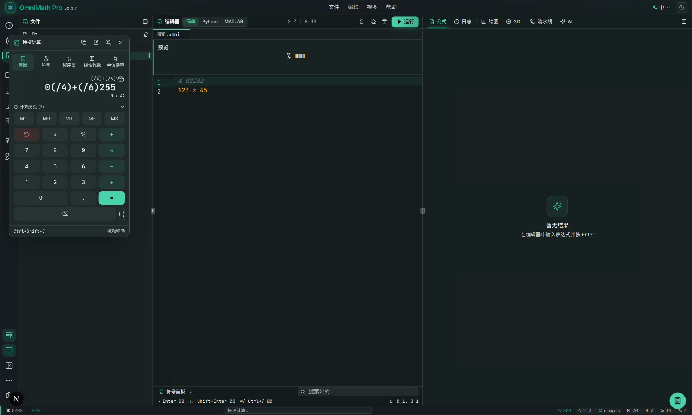

> [简体中文](README.md) | **繁體中文** | [English](README_en-US.md)

<!-- markdownlint-disable -->

<div align="center">


# OmniMath Pro

一款 **VSCode 風格的沉浸式數學工作台**<br>
基於 Tauri 2 + Next.js 16 + React 19 構建

[回報問題](https://github.com/humanfirework/OmniMath-Pro/issues) · [下載](https://github.com/humanfirework/OmniMath-Pro/releases)

[](https://github.com/humanfirework/OmniMath-Pro/releases/latest)
[](LICENSE)
[](https://github.com/humanfirework/OmniMath-Pro/actions)
[](https://github.com/humanfirework/OmniMath-Pro)
<br>


</div>

<!-- markdownlint-restore -->

---

## 預覽

### 工作台主頁


### 2D 函數繪圖


### 3D 曲面繪圖


### 線性代數求解


### Pipeline 節點工作流


### 求解器工作台


### 浮動計算器



### 設置面板


### 淺色模式


---

## 為什麼是 OmniMath Pro？

普通計算器功能有限，專業數學軟件又過於笨重。OmniMath Pro 取其中間態：

- **啟動快、離線用** — 基於 Tauri 的本地桌面應用，無需網絡
- **編輯器式互動** — 三欄佈局、命令面板、快捷鍵，像 VSCode 一樣順手
- **輸入即所得** — 支援類自然語言、Python/MATLAB 風格語法，實時渲染 LaTeX
- **可視化工作流** — 節點式 Pipeline，拖拽連接即可構建複雜計算圖
- **深度可定制** — 任務欄位置、面板顯隱、主題模式、自動隱藏均可記憶

---

## 核心功能

### 計算與符號運算

- 基於 **mathjs** 的高效能計算引擎
- 支援變量、函數、矩陣、複數、微積分、方程求解
- 多種輸入風格：簡潔模式 / Python 風格 / MATLAB 風格
- 變量面板實時查看與管理計算狀態

### 2D / 3D 繪圖

- 直角座標、極座標與參數方程 2D 繪圖
- 多曲線預設同一座標系疊加（overlay），分面（facet）保留為切換項
- 自動標註極值點與零點
- 滑鼠滾輪縮放、拖拽平移、懸停讀數
- 極端範圍與異常表達式防禦，避免崩潰
- 數學軟件風格配色（參考 JSXGraph / GeoGebra）
- 深色 / 淺色模式獨立配色，視覺一致性更佳
- **參數滑塊系統**：自動掃描表達式中的自由參數（排除自變量與已定義符號），為每個參數生成 Desmos 風格滑塊，支援數值輸入與範圍/步長編輯，拖動實時重繪，配置跨刷新持久化
- **自動交點**：一鍵計算所有可見曲線兩兩交點，圖上標註座標並在面板列出所屬曲線對，滑塊拖動時實時聯動更新
- 4 層 Canvas 架構流暢渲染（背景 / 網格 / 曲線 / 交互層）；滑塊拖動期間自動降採樣保幀率，鬆手後恢復高精度重採樣

### 公式渲染

- 使用 **KaTeX** 即時渲染 LaTeX
- 長公式支援水平捲動、縮放（0.6x–2.0x）與摺疊/展開
- 一鍵複製 LaTeX 源碼

### 線性代數

- 矩陣輸入、編輯與貼上解析（支援 MATLAB / CSV / TSV 格式）
- 高斯消元、LU / QR 分解、特徵值計算
- 線性方程組求解，自動判斷唯一解 / 無解 / 無窮解

### 求解器工作台

- 獨立全螢幕工作台（與線性代數工作台佈局一致），入口位於 ActivityBar 數學工具組
- 左側求解類型導航：方程 / 方程組 / 求導 / 積分 / 極限
- 右側輸入區 + KaTeX 結果區 + 分步展示區，主工作區不再受側邊欄寬度限制
- **分步求解增強**：求導步驟標註所用法則（冪法則 / 乘積 / 商 / 鏈式等），線性方程組逐步消元與回代，積分輸出中間變換步驟，每步以 KaTeX 渲染並附規則說明
- 結果可一鍵發送到 2D 繪圖繼續可視化

### 浮動計算器

- `Ctrl/Cmd + Shift + C` 快速調出便攜式計算器
- 五種模式：基礎計算、科學計算、程式設計師、線性代數、單位換算
- 支援長度、重量、溫度、面積、體積、時間單位轉換
- 可拖拽、可固定、可複製結果

### 節點式工作流（Pipeline）

- ComfyUI / Blueprint 風格的數學節點圖
- 拖拽節點、連接埠口、實時傳播計算結果
- 獨立 mathjs 作用域，不污染主工作台變量

### 界面與體驗

- **VSCode 風格佈局**：ActivityBar / SidePanel / Editor / Preview / StatusBar
- **任務欄**：支援左右切換、鎖定/解鎖、自動隱藏、手動隱藏
- **面板顯隱**：編輯器、預覽區、側邊欄、任務欄均可獨立顯示/隱藏，狀態自動記憶
- **深色 / 淺色主題**：高對比度配色，符合 WCAG 可讀性標準
- **中英文 i18n**：界面一鍵切換中/英文
- **命令面板**：`Ctrl/Cmd + Shift + P` 快速執行命令
- **設置面板**：7 大分類（外觀/編輯器/佈局/導出/語言/快捷鍵/關於），自動檢查更新，托盤最小化
- **結構化高級設置**：高級區由 JSON 文本編輯改為表單控件（數字輸入 / 開關 / 下拉），修改即時生效與持久化，非法輸入就地提示且不寫入
- **字體排印優化**：全局字體棧補充中文回退（Noto Sans SC / PingFang SC / 微軟雅黑等），canvas 刻度與標註統一字體並啟用等寬數字（tabular-nums）
- **統一過渡動畫**：視圖與面板切換使用輕量 transform/opacity 過渡（150–250ms），優先 CSS 過渡，不引入重型動畫依賴
- **無障礙**：支援 `prefers-reduced-motion` 系統偏好

---

## 下載安裝

前往 [Releases](https://github.com/humanfirework/OmniMath-Pro/releases) 頁面，選擇對應平台安裝包：

| 平台 | 推薦安裝包 |
|---|---|
| Windows | `OmniMath-Pro_xxx_x64-setup.exe` / `.msi` |
| macOS (Apple Silicon / M 系列) | `OmniMath-Pro_xxx_aarch64.dmg` |
| macOS (Intel) | `OmniMath-Pro_xxx_x64.dmg` |
| Linux | `OmniMath-Pro_xxx_amd64.deb` / `.AppImage` |

> 文件名中的 `xxx` 為版本號，請下載與你的系統架構匹配的版本。

---

## 技術棧

| 層級 | 技術 |
|---|---|
| 前端框架 | Next.js 16、React 19、TypeScript 5 |
| 樣式與組件 | Tailwind CSS v4、shadcn/ui、Framer Motion |
| 狀態管理 | Zustand |
| 計算引擎 | mathjs |
| 公式渲染 | KaTeX |
| 3D 渲染 | Three.js、react-three-fiber |
| 節點圖 | 自研 Canvas + SVG 節點引擎 |
| 桌面殼 | Tauri 2（Rust + wry/WebKit） |
| 打包 | Tauri bundler（.msi / .exe / .dmg / .deb / .AppImage） |

---

## 項目結構

```
omnimath-pro/
├── src/
│   ├── app/                    # Next.js App Router（layout / page / globals.css）
│   ├── components/
│   │   ├── workbench/          # 主工作台（佈局、面板、繪圖、節點）
│   │   │   ├── layout/         # ActivityBar、EditorPanel、PreviewPanel、SidePanel、StatusBar
│   │   │   ├── panels/         # History、Variables、FormulaLibrary、LinearAlgebra、Solver、CommandPalette
│   │   │   ├── plots/          # Plot2DCanvas 等繪圖組件
│   │   │   └── nodes/          # 節點式 Pipeline 引擎與 UI
│   │   └── ui/                 # shadcn/ui 組件庫
│   ├── lib/
│   │   ├── engine/             # 數學計算引擎與求值器
│   │   ├── plots/              # 2D/3D 繪圖採樣與輔助函數
│   │   ├── store/              # Zustand 狀態管理（含持久化）
│   │   └── i18n/               # 中英文翻譯字典
│   └── hooks/                  # 自定義 React Hooks
├── src-tauri/                  # Tauri 桌面殼（Rust）
│   ├── src/                    # main.rs / lib.rs
│   ├── icons/                  # 全平台應用圖標
│   ├── capabilities/           # Tauri 權限配置
│   └── tauri.conf.json         # 構建/窗口/打包配置
├── prisma/                     # Prisma schema（保留未來擴展）
├── public/                     # 靜態資源（logo、截圖等）
└── .github/workflows/          # 多平台自動發佈工作流
```

---

## 開發環境

### 前置依賴

- [Node.js](https://nodejs.org/) 或 [bun](https://bun.sh/)（推薦 bun）
- [Rust](https://rustup.rs/) stable

#### Linux 額外依賴

```bash
sudo apt-get update
sudo apt-get install -y libwebkit2gtk-4.1-dev build-essential curl wget file \
  libxdo-dev libssl-dev libayatana-appindicator3-dev librsvg2-dev libgtk-3-dev
```

#### Windows

- [Microsoft Visual C++ Build Tools](https://visualstudio.microsoft.com/visual-cpp-build-tools/)
- [WebView2](https://developer.microsoft.com/microsoft-edge/webview2/)（Win11 已自帶）

#### macOS

- Xcode Command Line Tools：`xcode-select --install`

### 本地開發

```bash
# 安裝依賴
bun install

# 方式一：純 Web 開發（瀏覽器訪問 http://localhost:3000）
bun run dev

# 方式二：Tauri 桌面開發模式（自動打開桌面窗口）
bun run tauri:dev
```

### 構建 Web 產物

```bash
bun run build       # 靜態導出到 ./out/
bun run preview     # 本地預覽 ./out/
```

### 構建桌面安裝包（當前平台）

```bash
bun run tauri:build
```

產物位於 `src-tauri/target/release/bundle/`。

---

## 自動發佈

推送 `v*` 標籤即可觸發 GitHub Actions，自動在 Windows、macOS（Intel + Apple Silicon）、Linux 上構建並發佈到 Release：

```bash
git tag v0.1.0
git push origin v0.1.0
```

詳見 [`.github/workflows/release.yml`](.github/workflows/release.yml)。

---

## 常用命令

| 命令 | 作用 |
|---|---|
| `bun run dev` | 啟動 Next.js 開發伺服器 |
| `bun run build` | 靜態導出到 `out/` |
| `bun run lint` | 執行 ESLint 代碼檢查 |
| `bun run tauri:dev` | Tauri 桌面開發模式 |
| `bun run tauri:build` | 構建當前平台桌面安裝包 |
| `bun run db:push` | Prisma schema 同步（可選） |

---

## 許可證

[MIT](LICENSE)
