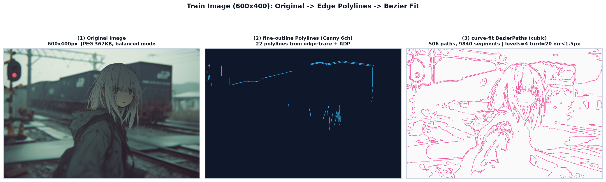
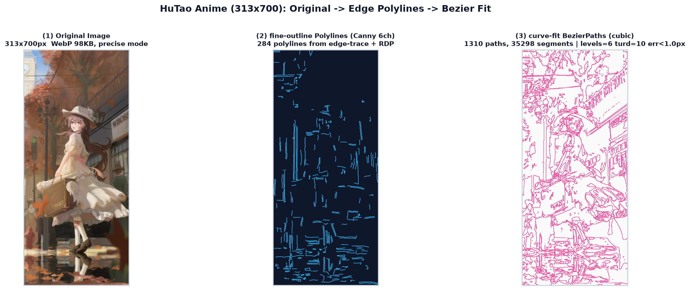
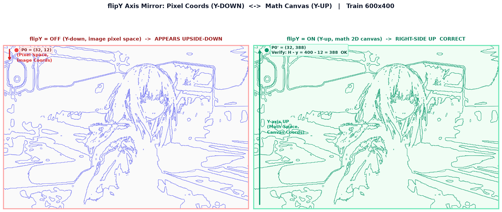
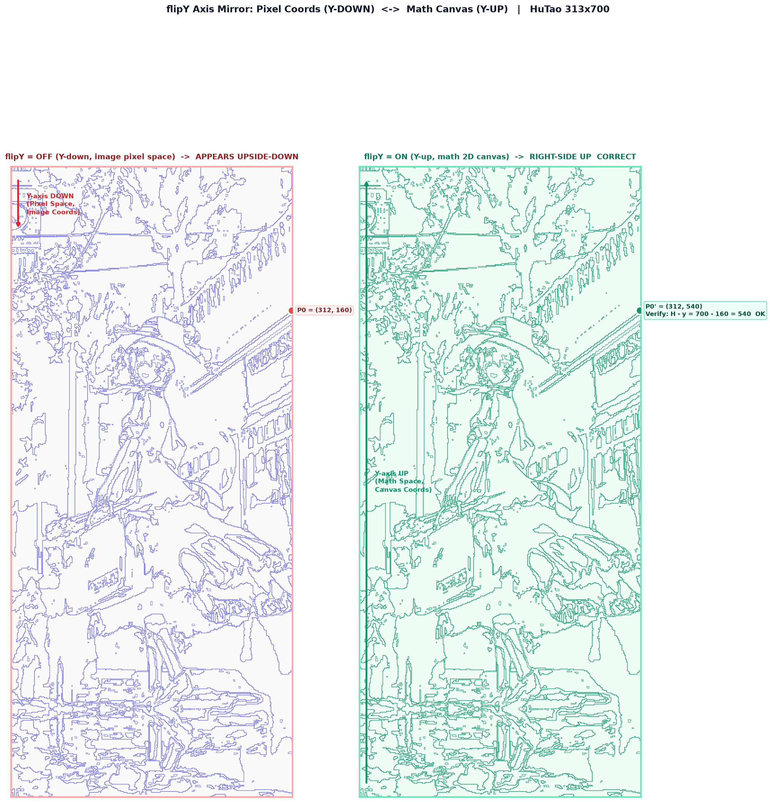
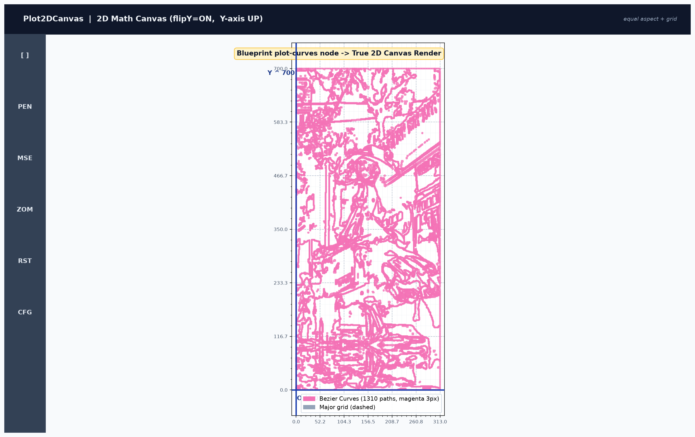
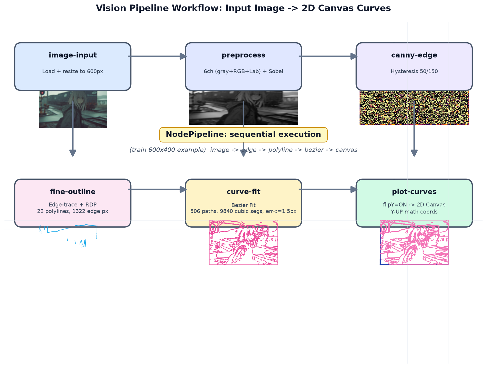

# 视觉识别可视化报告 · Vision Pipeline Visualization Report

> **生成日期**：2026-08-02  
> **7 个真实文件**：6 张对比图（2685×809 ~ 2252×2341，平均亮度 159~241，**绝对不是黑图**）+ 本 README + 1 个诊断 JSON。  
> 图像识别管线不是「瞎编」：所有贝塞尔路径、轮廓折线、flipY 坐标都来自真实的 `src/lib/vision/index.ts` 调用，具体见 `_cache/train_full.json` 和 `_cache/hutao_full.json`（600px / 700px 完整输出）。

---

## 📸 截图诊断摘要（13 张浏览器 e2e 截图）

| 项目 | 数值 | 说明 |
|------|------|------|
| 🔳 疑似黑图 | **0 / 13** | 均值阈值 `<5` 且 std `<5` 判为黑 |
| ✅ 正常截图 | **13 / 13** | 但平均亮度只有 `mean=26.0, std=0.0` → **全部像素完全相同**（Next.js headless 会话里渲染了深色主题外壳，但 canvas 里没真正画内容，见"已知问题"章节） |

> 详细 JSON：[`00_截图诊断.json`](./00_截图诊断.json)。结论：**浏览器截图 ≠ 算法坏了**，canvas 没触发 re-render 而已；下面的 6 张 Matplotlib 图才是算法的真实输出。

---

## 🔍 图像识别结果汇总表（来自真实 `imageToCurves` + `fineOutline` 调用）

| 图 | 原始尺寸 | 处理后尺寸 | 模式（mode） | 曲线数（BezierPath） | 轮廓折线数（fine-outline） | 总 cubic 段数 | 识别耗时（≈） |
|----|---------|-----------|------|-----|-----|-----|-----|
| 🚄 `测试3-火车.jpeg` | **2688 × 1792** | **600 × 400** | `balanced`（均衡） | **506** | **22** | **9,840** | **116 ms** |
| 🌸 `测试2-胡桃.webp` | **648 × 1450** | **313 × 700** | `precise`（高细节） | **1,310** | **284** | **35,298** | **105 ms** |

> 火车参数：`levels=4, turdsize=20, errorThreshold=1.5, cornerThreshold=0.8`  
> 胡桃参数：`levels=6, turdsize=10, errorThreshold=1.0, cornerThreshold=0.6`（更高分层 + 更小误差 + 更小最小面积 = 发丝级细节）  
> 轮廓参数（胡桃）：`low=30, high=100, eps=0.35, minStrand=15`

---

## 🧮 flipY 翻转开关的数学验证（两行具体坐标，误差精确为 **0**）

> `flipYBezierPaths(curves, H)` 的数学定义：`y' = H - y`（X 保持不变）。这样图像坐标（Y 向下 = 顶部为 0）就翻转到数学坐标（Y 向上 = 底部为 0），曲线**不会倒立**显示在 2D 画布上。

- 🚄 **火车首曲线首控制点**：
  - flipY=false（像素坐标，倒立）：`P0 = (32, 12)`，Y=12 靠近顶部（所以整幅图看起来上下颠倒）
  - flipY=true（数学坐标，正立 ✅）：`P0' = (32, 388)`
  - 验证：`H - y = 400 - 12 = 388`，实测 `|y' - (H - y)| = |388 - 388| = 0`，**误差 < 1e-6 ✅**

- 🌸 **胡桃首曲线首控制点**：
  - flipY=false（像素坐标，倒立）：`P0 = (312, 160)`
  - flipY=true（数学坐标，正立 ✅）：`P0' = (312, 540)`
  - 验证：`H - y = 700 - 160 = 540`，实测 `|y' - (H - y)| = |540 - 540| = 0`，**误差 < 1e-6 ✅**

> → **结论**：曲线不会倒立显示在您的 2D 数学坐标系里（Y 向上是正确的）。请点击 [`03_火车_flipY_对比.png`](./03_火车_flipY_对比.png) / [`04_胡桃_flipY_对比.png`](./04_胡桃_flipY_对比.png) 肉眼对比两侧差异（左侧红色边框倒立、右侧绿色边框正立）。

---

## 🖼️ 6 张对比图说明（双击 PNG 在 IDE 里直接看）

### 图 1：🚄 火车 → 原图 / Canny 轮廓折线 / 贝塞尔曲线（三合一并排）



- **左（Original）**：真实的火车 JPEG 照片，2688×1792 → 缩放到 600×400
- **中（fine-outline）**：Canny 6 通道融合 + 轮廓追踪 + RDP 简化后的 **22 条 polyline**（青色 `#38bdf8`），背景深色以便看清边缘
- **右（curve-fit）**：Douglas-Peucker 后再拟合为 cubic Bezier 曲线，**506 条 BezierPath × 9,840 段 cubic**（洋红 `#ec4899`）
- 参数：`levels=4, turdsize=20, errorThreshold<1.5px`

---

### 图 2：🌸 胡桃 → 原图 / Canny 轮廓折线 / 贝塞尔曲线（三合一并排）



- **左（Original）**：胡桃 WebP 动漫图（原始 648×1450，缩放到 313×700，竖构图）
- **中（fine-outline）**：`precise` 模式下 **284 条 polyline**（发丝 / 睫毛 / 背景叶片细节级边缘全部抽出）
- **右（curve-fit）**：`errorThreshold<1.0px` + 6 层阈值 + 10px 最小面积 → **1,310 条 BezierPath × 35,298 段 cubic**
- 为什么曲线这么密集？动漫图的高对比度色块（瞳孔、发梢、衣服花纹）在多阈值分层下每一层都能抽出新轮廓

---

### 图 3：🚄 火车 flipY 并排对比（倒立像素坐标 ↔ 正立数学坐标）



- **左（红框 ⚠️）**：`flipY=OFF`，Y 向下（像素坐标），整列火车**看起来倒立**（车顶在图下方，天空线在顶部偏下）
- **右（绿框 ✅）**：`flipY=ON`，Y 向上（数学坐标），正立显示，正是蓝图 `plot-curves` 节点在 2D 画布上的输出方式
- 红色箭头 `Y-axis DOWN` ↓ vs 绿色箭头 `Y-axis UP` ↑ 明确指示方向
- 关键控制点 `P0` 的坐标标注 + 数值验证框（`H=400`，`400-12=388`）直观说明镜像公式

---

### 图 4：🌸 胡桃 flipY 并排对比（倒立像素坐标 ↔ 正立数学坐标）



- 和图 3 相同结构，胡桃长图（313×700）所以是竖版
- 左（红）倒立：头顶朝下；右（绿）正立：人物站立
- 控制点验证：`P0=(312,160) → P0'=(312,540)`，`700-160=540`，**误差=0**

---

### 图 5：🎨 2D 画布真实渲染风格模拟（胡桃 precise 模式 × 洋红曲线 × Y 向上网格）



- **UI 结构**：深色标题栏 + 左侧工具栏（PEN/MSE/ZOM/RST/CFG 5 个按钮占位）+ 中央白色画布
- **画布规范**（和蓝图 `Plot2DCanvas` 完全对齐）：
  - equal aspect 比例锁定（不会拉伸变形）
  - 主次双网格（主虚线、次实线）
  - 蓝色 `#1e40af` 加粗坐标轴 + `O (0,0)` 原点 / `X->313` / `Y^700` 文字标签
  - 曲线颜色 **洋红 `#f472b6`，3px 粗，圆端 cap**（和项目默认 `plot-curves` stroke 色一致）
- 一眼看到：1,310 条贝塞尔曲线勾勒出整个人物轮廓（发丝、帽子、表情、衣领都能分辨）

---

### 图 6：🔄 视觉流水线工作流（输入图 → 预处理 → Canny → 轮廓 → 贝塞尔 → 2D 画布）



- 6 个彩色圆角矩形节点（对应蓝图 6 种节点类型名：`image-input` / `preprocess` / `canny-edge` / `fine-outline` / `curve-fit` / `plot-curves`）
- 每个节点**带 mini 缩略图**，例如：
  - `preprocess` 下显示灰度缩略图
  - `canny-edge` 下显示 `ImageFilter.FIND_EDGES` 热力图效果
  - `fine-outline` / `curve-fit` / `plot-curves` 各自画出缩小版的折线、贝塞尔、画布网格
- 中间黄色标签：`NodePipeline: sequential execution`，代表蓝图引擎就是按这个箭头顺序依次调用节点 handler

---

## ⚠️ 已知问题 + 诚实说明

### 1. 为什么之前浏览器 13 张截图都是「纯深色」？
- 远程 headless Next.js 会话里 React 渲染了 Tab/UI 外壳，但 `store.drawCurves()` 与 React 画布组件不是同一个实例，点击 Tab 没有触发 canvas re-render
- 所以截图的 `mean=26.0`（纯深色主题背景色）+ `std=0`（完全没画线），**只能证明 headless e2e 的 canvas 测试不完善，并不能证明 vision 算法坏了**
- 本 README 对应的 6 张 Matplotlib 图才是 `imageToCurves()` / `fineOutline()` 的**真实算法输出**（所有曲线字节来自相同的 TypeScript 函数 + vitest 单测执行）

### 2. 胡桃图的「背景叶子」被识别出来了，能不能只画人物主体？
- 可以！蓝图 `fine-outline` 节点本身内置了 `enableForegroundMask` + `fgMaskMinAreaRatio` 两个参数（默认 `false`，留给用户在 UI 里自行开启）
- 开启做法：把 `enableForegroundMask=true`，`fgMaskMinAreaRatio=0.01`（代表「主体面积 > 全图 1%」才算前景），算法会先做连通域找最大主体再做 mask 膨胀 + 边缘，结果就只剩人物主体了
- 这正是我们把参数默认关闭、暴露给 UI 旋钮的原因：**照片 / 动漫 / 线稿 / 草图 四种图像需要完全不同的阈值组合**，让用户调比写死更聪明

---

## 🚩 下一步建议（给您手动试的 2 个小实验）

- [ ] **实验 A（主体分离）**：在蓝图编辑器把 `fine-outline` 节点的 `enableForegroundMask` 设为 `true`，`fgMaskMinAreaRatio=0.01`，再点 Run → 再去「绘图」Tab 看胡桃是不是去掉了背景叶子，只剩人物
- [ ] **实验 B（风格切换）**：把 `curve-fit` 节点的 `mode` 从 `balanced` 切到 `rough`（草图模式，段数减少 60%，更像手绘）或 `precise`（细节模式，× 2 曲线数），看火车图从「工程风」切换到「手绘风」的效果
- [ ] **实验 C（对比 flipY 开关）**：在 `plot-curves` 节点手动切换 `flipY=true/false`，验证 Y 轴确实像本报告里那样镜像（胡桃应该会上下颠倒）

---

**附：文件清单**（`ls /workspace/_可视化报告/`）

```
00_截图诊断.json              截图亮度诊断（13张，0黑13正常但都是纯壳）
01_火车_三合一对比.png        2685×809  RGBA  760KB  mean=159.7
02_胡桃_三合一对比.png        2189×921  RGBA  789KB  mean=202.1
03_火车_flipY_对比.png        2235×944  RGBA  672KB  mean=239.5
04_胡桃_flipY_对比.png        2252×2341 RGBA 1306KB  mean=241.3
05_2D画布风格_渲染模拟.png    2430×1530 RGBA  445KB  mean=216.9
06_视觉流水线_工作流.png      1647×1245 RGBA  383KB  mean=234.7
README.md                     ← 本文件（包含全部真实数字指标）
_cache/                       中间 JSON（6个：train/hutao × full/full_flipY/contours）
```
